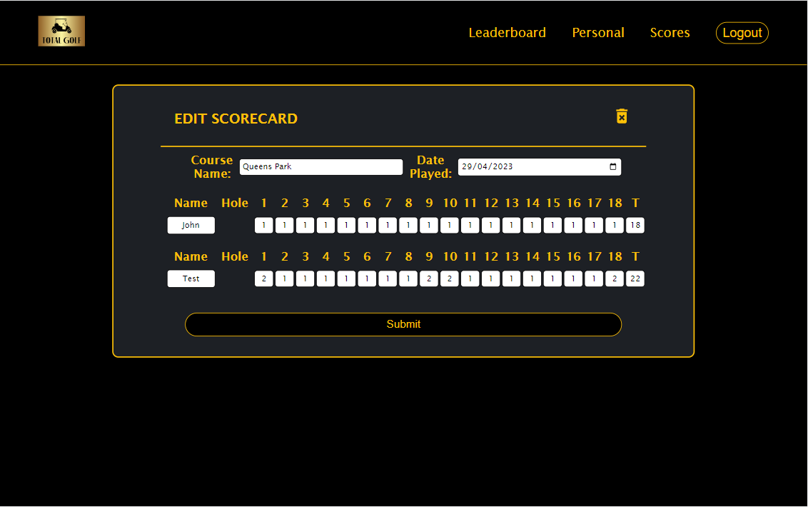

# Total Golf [](https://opensource.org/licenses/MIT)

## Links
- [GitHub](https://github.com/seanscott95/total-golf)
- [Tough Tracking](https://total-golf.herokuapp.com/)
<p>Please allow site to load for 10-15 seconds</p>

## Description
<p>This application creates a golf scorecard that keeps track of you and your mates scores.
</p>
<p>Setup a site password during installation so only you and your mates can sign up
</p>
<p>Create a scorecard that includes the date, course played at and all the players names and scores saved in your database
</p>
<p>Compete with your friends to see who is better by checking out the Leaderboard page where you'll be able to see the top three highest scores depending on the number of holes on the scorecard
</p>
<p>Check out your own scores where you can see your own average best and worst for all the games played broken down by number of holes played and below that all of the games you've played
</p>

<p>This application was created with JavaScript and included the following technologies:</p>

- [React.js](https://reactjs.org/)

- [Node.js](https://nodejs.org/en/)

- [Redux-Toolkit](https://redux-toolkit.js.org/)

- [Express](https://www.npmjs.com/package/express)

- [React-Router](https://reactrouter.com/en/main)

- [bcrypt](https://www.npmjs.com/package/bcrypt)

- [Json-Web-Token](https://www.npmjs.com/package/jsonwebtoken)

- [Mongoose](https://www.npmjs.com/package/mongoose)

- [Dotenv](https://www.npmjs.com/package/dotenv)

    
## Table of Contents 
- [Screenshots](#Screenshots)
- [Installation](#Installation)
- [Usage](#Usage)
- [License](#License)
- [Questions](#Questions)

## Screenshots

<p>Leaderboard Page</p>

- 
- 

<p>Personal Page</p>

- 
- 

<p>Scorecard Form</p>

- 

<p>Single Scorecard</p>

- 

<p>Edit Scorecard</p>

- 

<p>Scores Page</p>

- 

<p>Signin Page</p>

- 

<p>Site Password</p>

- 

<p>Signup Page</p>

- 

<p>Leaderboard Page Phone Screen</p>

- 

<p>Scores Page Small Screen</p>

- 

<p>Create Scorecard Phone Screen</p>

- 

## Installation
<p>If you would like to download the application please follow these instructions:
</p>

- Please have Node.js, npm, git and mongodb installed and/or setup.

- To start, clone this repository by using the following command:

 ```
  git clone git@github.com:seanscott95/Total-Golf.git
 ```

- Environmental Variables:
    - For this application to work you must set up the env files that are needed
    - There are two files that require env variables, please find the env.EXAMPLE files to see an example of how they are structured in the root file and the client file
    - The env file in the root folder needs four env variables. If user is unsure on how to set up the env variables they can search for the env variables NODE_ENV, PORT, MONGO_URI and JWT_SECRET online as for their meaning. The only really important and confusing variable is the MONGO_URI so please do your research for setup
    - The other env file is the site password which is set by the user so that random visitors can not sign up
    - Remember there are no quotations necessary

- In your terminal navigate to the cloned repository and run ```npm run install``` to install the node modules needed for this application.

- Then enter ```npm run develop``` to start the application.

- If your browser doesn't open straight away you can search for it using the url ```http//:localhost:3000```

## Usage
- When creating a scorecard fill in the form for the users and their names and click add. This will add a score to your golf scorecard. You can add as many as you want.
- Make sure to have filled in the date and the course name if not already. When you're done click create and the scorecard will be created for you.
- You can edit and delete the scorecard by clicking on a scorecard which will view just the scorecard and where you can click the edit button to edit or delete the scorecard.

## License 
<p> This application is covered under the:</p>

- [MIT-License](https://opensource.org/licenses/MIT)

## Questions 
<p> To reach me with additional questions please contact me via one of the following methods: </p>

- [GitHub](https://github.com/seanscott95)
- [Email](mailto:seanms418@gmail.com)
- [LinkedIn](https://www.linkedin.com/in/sean-scott-18ba07225/)